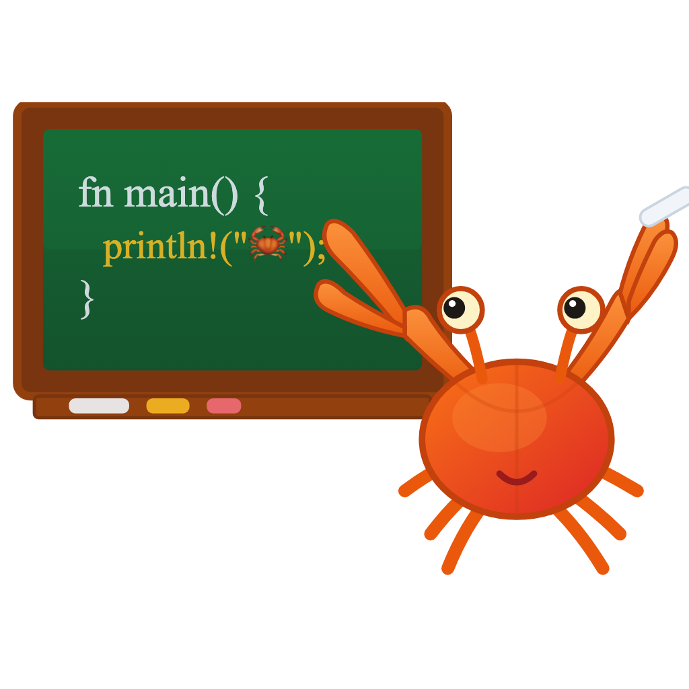

# Crab-Cademy

**Interactive Educational Platform for Rust Development**

Crab-Cademy is an interactive learning platform designed to facilitate mastery of the Rust programming language. The application provides high-quality educational content integrated with a built-in development environment and terminal, enabling users to write, execute, and validate Rust code within a web browser or as a native desktop application.



## Core Features

- **Integrated Curriculum**: Comprehensive lessons based on "The Rust Book" and specialized technical modules such as Polars.
- **Dual Runtime Environments**:
  - **Web-Based Execution**: Utilizes the Rust Playground for immediate, configuration-free learning.
  - **Native Desktop Execution**: Leverages the Tauri framework for local code execution, suitable for performance-critical applications and offline development.
- **Real-Time Execution and Feedback**: Features a Monaco-based code editor with syntax highlighting and an integrated terminal for immediate verification of test results.
- **Structured Learning Path**: Includes progress tracking, assessment quizzes, and achievement milestones to support student engagement.

## Technical Architecture

- **Frontend Framework**: Vue 3 with TypeScript
- **Desktop Runtime**: Tauri
- **Build System**: Vite
- **Styling Engine**: Tailwind CSS
- **Automated Testing**: Playwright
- **Code Editor**: Monaco Editor

## Deployment and Installation

### Prerequisites

- Node.js (version 18 or higher)
- Rust (current stable release)

### Installation Procedure

1. Clone the repository:
   ```bash
   git clone https://github.com/finchfry94/crab-cademy.git
   cd crab-cademy
   ```

2. Install project dependencies:
   ```bash
   npm install
   ```

### Application Execution

- **Web Application (Development Mode)**:
  ```bash
  npm run dev
  ```
- **Desktop Application (Tauri Development Mode)**:
  ```bash
  npm run tauri dev
  ```

---

## Contribution Guidelines

Contributions to the project are welcome. Follow the guidelines below to maintain consistency and quality across the platform.

### Content Development

Educational modules are defined as TypeScript files located within the `src/data/lessons/` directory.
1. Define the lesson content in a new `.ts` file using the established schema.
2. Register the module metadata in the corresponding `index.ts` file.
3. Develop associated end-to-end tests within the `tests/` directory using Playwright.

### Testing Protocols

Automated testing is managed via the Playwright framework.
- **Full Test Suite**: `npm run test`
- **Interactive UI Testing**: `npx playwright test --ui`

### Development Standards

Maintain existing code patterns and ensure all changes pass the build process:
```bash
npm run build 
```

## Acknowledgments

This project utilizes educational content from the official Rust documentation.

- **The Rust Programming Language**: Written by Steve Klabnik and Carol Nichols, with contributions from the Rust Community. The content is used in accordance with its dual-licensing under the MIT and Apache 2.0 licenses. 
- **Rust Playground**: Browser-based execution is powered by the [Rust Playground](https://play.rust-lang.org/).

## License

This project is released under the MIT License. Refer to the `LICENSE` file for further details.

---

Maintained by the Crab-Cademy Development Team.
